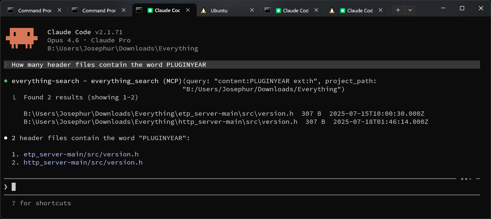

# Everything MCP Server

An [MCP (Model Context Protocol)](https://modelcontextprotocol.io/) server that gives AI assistants like [Claude Code](https://claude.ai/code) instant file search capabilities via [Everything](https://www.voidtools.com/) by voidtools.

Everything is a lightning-fast file search engine for Windows that indexes all files and folders on NTFS drives. This MCP server exposes Everything's search as a tool that AI assistants can call, enabling them to find files across your system in milliseconds.



## Prerequisites

- **Windows** with [Everything](https://www.voidtools.com/) installed and running
- **Everything HTTP Server** enabled (Everything > Tools > Options > HTTP Server > Enable HTTP Server)
- **Node.js** 18+

## Installation

```bash
git clone https://github.com/Josephur/everything-mcp-server.git
cd everything-mcp-server
npm install
npm run build
```

## Configuration

### Claude Code

Run this command from the cloned repository directory:

```bash
claude mcp add --scope user everything-search -- node /path/to/everything-mcp-server/dist/index.js
```

This registers the MCP server globally so it's available in every Claude Code project. Replace `/path/to/everything-mcp-server` with the actual path where you cloned the repo.

**Scope options:**
- `--scope user` — available in all projects (recommended)
- `--scope project` — only available in the current project

To verify it was added:

```bash
claude mcp list
```

To remove it later:

```bash
claude mcp remove --scope user everything-search
```

### CLAUDE.md Instructions

The `claude mcp add` command doesn't support an `instructions` field. To teach Claude how to prioritize this tool, add the following to your global `~/.claude/CLAUDE.md` file, make sure to change the port number to the port number your Everything HTTP Plugin is listening on (create it if it doesn't exist):

```markdown
## Everything Search (MCP Tool)

This machine has **Everything (voidtools)** running with an HTTP server on port 54321.
The `everything_search` MCP tool is available in every session.

### MANDATORY: Use Everything FIRST
**ALWAYS attempt `everything_search` FIRST for ANY file search** — whether by name,
path, extension, size, date, or content (`content:` prefix). This applies to every
search task, including content searches within a project. Do NOT default to Grep,
Glob, or Bash for initial searches.

### Fallback to other tools (ONLY after Everything fails or is insufficient)
If Everything returns an error (e.g. connection refused), returns no results, or
the query requires features Everything doesn't support, THEN fall back to:
- **Grep** — for complex regex content searches, or if Everything's `content:` returns nothing
- **Glob** — for precise relative-path pattern matching within the current project
- **Bash `find`** — for searches involving file permissions, symlinks, or other attributes Everything doesn't index

**Always try Everything first. Only fall back if it fails or returns insufficient results.**

### Search syntax quick reference
- `ext:py` — find by extension (multiple: `ext:ts;js`)
- `path:src\components` — match against full path
- `count:10` — limit number of results to 10
- `*.config.*` — wildcards
- `size:>10mb` — size filter
- `dm:today` / `dm:thisweek` — date modified filter
- `content:keyword` — search inside file contents
- `parent:node_modules package.json` — match parent folder
- `foo bar` — AND, `foo | bar` — OR, `!foo` — NOT
- `"exact phrase"` — literal match
```

This ensures Claude always prioritizes Everything over built-in search tools.

### Environment Variables

| Variable | Default | Description |
|----------|---------|-------------|
| `EVERYTHING_HOST` | `localhost` | Everything HTTP server hostname |
| `EVERYTHING_PORT` | `54321` | Everything HTTP server port |
| `EVERYTHING_MAX_RESULTS` | `255` | Max results per query — see [Result Limit](#result-limit) |
| `PROJECT_PATH` | _(none)_ | Default project path for auto-scoping searches |

Set the port to match your Everything HTTP server configuration (Everything > Tools > Options > HTTP Server).

### Result Limit

To keep token usage under control, the server caps the maximum number of results returned per query to **255** by default. The AI can still request fewer results via the `count` parameter, but it can never exceed this cap.

If you need more results per query, increase the limit by setting `EVERYTHING_MAX_RESULTS` when adding the server:

```bash
claude mcp add --scope user everything-search -e EVERYTHING_MAX_RESULTS=500 -- node /path/to/everything-mcp-server/dist/index.js
```

Higher values return more results but consume more tokens per search. For most use cases, the default of 255 is a good balance. If you find searches are missing results, try increasing it. If you want to reduce token usage further, lower it (e.g. `"100"`).

## How It Works

The server communicates with Everything's built-in HTTP server, which returns JSON search results. The flow is:

```
Claude Code  -->  MCP Server (stdio)  -->  Everything HTTP Server  -->  Everything Index
                  (this project)           (port 54321)                 (NTFS volumes)
```

1. Claude Code calls the `everything_search` tool via MCP (stdio transport)
2. This server translates the request into an HTTP query to Everything's HTTP API
3. Everything searches its pre-built index and returns results as JSON
4. The server formats the results (paths, sizes, dates) and returns them to Claude

### Project Scoping

By default, searches are automatically scoped to the current project folder using the `project_path` parameter. This prevents the AI from inadvertently searching or accessing files outside your project.

- **Default behavior**: The server prepends `path:"<project_path>"` to queries automatically
- **Global search**: Set `global: true` to search the entire system. The server will include a warning in the response reminding the AI to ask for user permission before accessing files outside the project
- **Explicit path**: If your query already contains a `path:` filter, auto-scoping is skipped

## Tool: `everything_search`

### Parameters

| Parameter | Type | Default | Description |
|-----------|------|---------|-------------|
| `query` | string | _(required)_ | Everything search query |
| `count` | number | `50` | Max results to return (max 255, configurable via `EVERYTHING_MAX_RESULTS` env var) |
| `offset` | number | `0` | Result offset for pagination |
| `sort` | string | `"name"` | Sort by: `name`, `path`, `size`, `date_modified` |
| `ascending` | boolean | `true` | Sort direction |
| `regex` | boolean | `false` | Enable regex search mode |
| `case_sensitive` | boolean | `false` | Case-sensitive matching |
| `whole_word` | boolean | `false` | Match whole words only |
| `match_path` | boolean | `false` | Match against full path instead of filename |
| `global` | boolean | `false` | Search entire system (requires user confirmation) |
| `project_path` | string | _(none)_ | Project folder path for auto-scoping |

### Search Syntax

Everything uses its own search syntax:

| Syntax | Description | Example |
|--------|-------------|---------|
| `ext:` | Filter by extension | `ext:py`, `ext:ts;js` |
| `path:` | Match against full path | `path:src\components` |
| `size:` | Filter by file size | `size:>10mb`, `size:1kb..100kb` |
| `dm:` | Date modified filter | `dm:today`, `dm:thisweek` |
| `dc:` | Date created filter | `dc:thismonth` |
| `content:` | Search file contents | `content:TODO` (requires content indexing) |
| `parent:` | Match parent folder | `parent:node_modules package.json` |
| `*` `?` | Wildcards | `*.config.*` |
| `" "` | Exact phrase | `"my file.txt"` |
| _(space)_ | AND | `foo bar` |
| `\|` | OR | `foo \| bar` |
| `!` | NOT | `!node_modules` |

### Example Queries

```
ext:py                          # All Python files
ext:ts path:src                 # TypeScript files under any src/ folder
size:>100mb                     # Files larger than 100MB
dm:today ext:js                 # JavaScript files modified today
content:TODO ext:py             # Python files containing "TODO"
*.config.* !node_modules        # Config files, excluding node_modules
```

## Example: Global CLAUDE.md Instructions

To teach Claude Code how to use this tool effectively, add something like this to your `~/.claude/CLAUDE.md`:

```markdown
## Everything Search (MCP Tool)

This machine has **Everything (voidtools)** running with an HTTP server on port 54321.
The `everything_search` MCP tool is available in every session.

### MANDATORY: Use Everything FIRST
**ALWAYS attempt `everything_search` FIRST for ANY file search** — whether by name,
path, extension, size, date, or content (`content:` prefix). This applies to every
search task, including content searches within a project. Do NOT default to Grep,
Glob, or Bash for initial searches.

### Fallback to other tools (ONLY after Everything fails or is insufficient)
If Everything returns an error (e.g. connection refused), returns no results, or
the query requires features Everything doesn't support, THEN fall back to:
- **Grep** — for complex regex content searches, or if Everything's `content:` returns nothing
- **Glob** — for precise relative-path pattern matching within the current project
- **Bash `find`** — for searches involving file permissions, symlinks, or other attributes Everything doesn't index

**Always try Everything first. Only fall back if it fails or returns insufficient results.**

### Search syntax quick reference
- `ext:py` — find by extension (multiple: `ext:ts;js`)
- `path:src\components` — match against full path
- `count:10` — limit number of results to 10
- `*.config.*` — wildcards
- `size:>10mb` — size filter
- `dm:today` / `dm:thisweek` — date modified filter
- `content:keyword` — search inside file contents
- `parent:node_modules package.json` — match parent folder
- `foo bar` — AND, `foo | bar` — OR, `!foo` — NOT
- `"exact phrase"` — literal match
```

## Development

```bash
# Build
npm run build

# Run directly
npm start

# Watch mode (requires installing a file watcher)
npx tsc --watch
```

### Project Structure

```
src/
  index.ts        # MCP server setup and tool handler
  everything.ts   # Everything HTTP API client
  types.ts        # TypeScript interfaces
```
